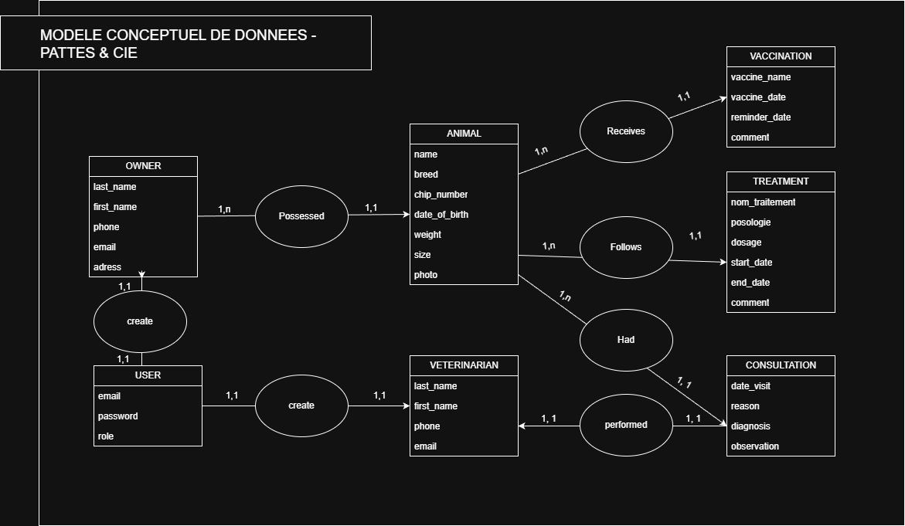
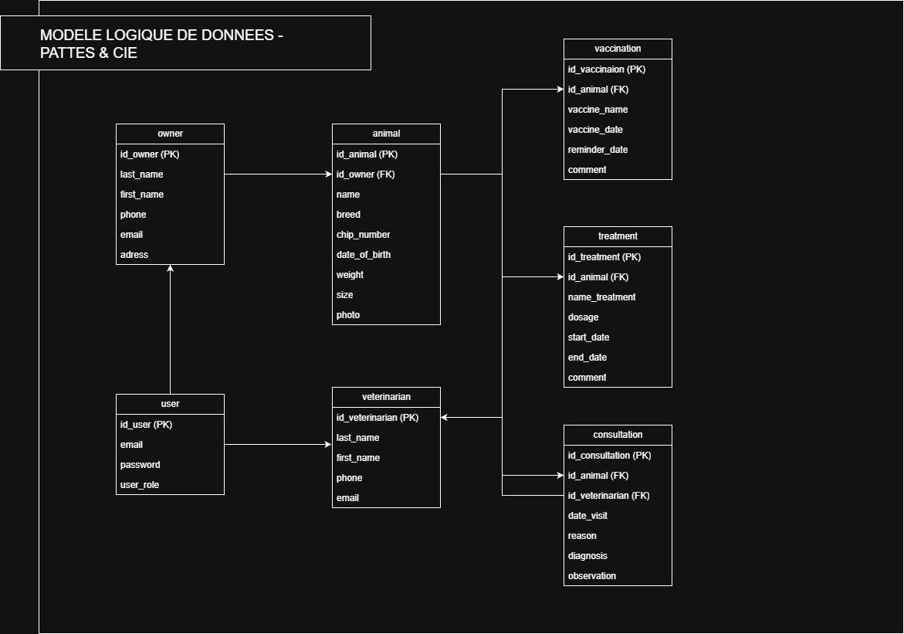
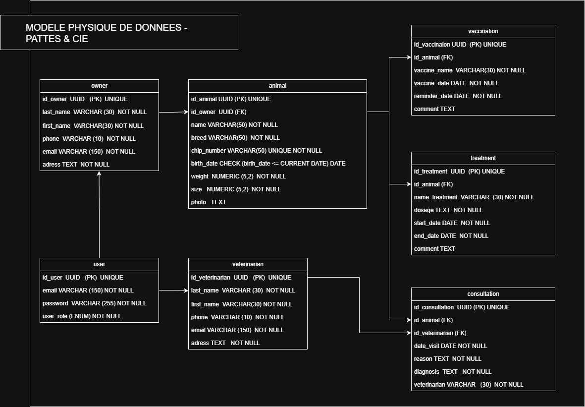

# Patte & Cie – Backend

Backend de l’application **Patte & Cie** (carnet de santé animal).
Ce projet fournit une API REST basée sur **Node.js**, **Express** et **PostgreSQL (Neon)**.

---

## MCD - MLD - MPD




## Techno
- **Node.js** : environnement d’exécution JavaScript
- **Express** : framework backend pour la création de l’API REST
- **TypeScript** : typage statique pour sécuriser le code
- **PostgreSQL** : base de données relationnelle
- **Neon** : hébergement de la base de données PostgreSQL
- **Prisma** : ORM pour l’accès et la gestion de la base de données
- **Git / GitHub** : gestion de versions et travail collaboratif

## Architecture du projet
```bash
.
├── src/
│   ├── server.ts
│   │   → Point d’entrée de l’application
│   │   → Lance le serveur Express et définit le port
│   │
│   ├── app.ts
│   │   → Configuration principale d’Express
│   │   → Enregistrement des routes et middlewares globaux
│   │
│   ├── routes/
│   │   → Définition des endpoints de l’API
│   │
│   ├── controllers/
│   │   → Gestion des requêtes HTTP et des réponses
│   │
│   ├── services/
│   │   → Logique métier et accès aux données
│   │
│   ├── middlewares/
│   │   → Authentification, autorisation et gestion des erreurs
│   │
│   └── repositories/
│       → Accès à la base de données (Prisma)
│
├── Http/
│   → Fichiers `.http` pour tester les routes
│   → Utilisés avec l’extension REST Client de VS Code
│
├── database/
│   → Modélisation de la base de données
│   → MCD / MLD / MPD et scripts SQL
│
├── prisma/
│   → Schéma Prisma et migrations
│
├── swagger.js
│   → Configuration de Swagger
├── swagger-output.json
│   → Documentation Swagger générée
│
├── package.json
│   → Dépendances et scripts du projet
├── tsconfig.json
│   → Configuration TypeScript
└── README.md
│   → Documentation du projet
```
## Swagger : documentation des routes
```bash
http://localhost:3000/api-docs/
```

## Test des routes via : /Http
REST Client (extension VS Code) à l’aide des fichiers .http  
Le dossier /http contient des exemples de requêtes pour tester :  
- la création d’utilisateurs
- l’authentification (login)
- les routes protégées par JWT et rôles

## Lancer le projet en local
```bash
npm install
npm run dev
```

## Démarrage du serveur local:
```bash
http://localhost:3000
```

## Base de données
La base de données est une base **PostgreSQL** hébergée sur **Neon**.

### Création et données
- La structure de la base est définie dans `database/create_tables.sql`
- Un script de test permet d’injecter des données : `database/seed.sql`

### Accès à la base de données
- La base de données est hébergée sur **neon.tech**
- L’accès à la base se fait via **Prisma** (ORM)

### UUID

Les identifiants sont générés sous forme d’**UUID directement en base de données**, afin de :

- garantir l’unicité des identifiants
- éviter les conflits lors du travail collaboratif
- ne pas exposer des identifiants incrémentaux

### Commandes Prisma principales
```bash
# Générer le client Prisma
npx prisma generate

# Appliquer les migrations en local
npx prisma migrate dev

# Ouvrir Prisma Studio
npx prisma studio
```


## Authentification 
L’API met en place une authentification basée sur les utilisateurs, distincte des profils métiers (owner, veterinarian).  
- Un user représente un compte applicatif (email + mot de passe)  
- Les entités owner et veterinarian sont des profils liés à un user  
- Un user possède un rôle (owner, veterinarian, admin) qui détermine ses droits  

- Un JWT est généré après vérification des identifiants
- Le token contient l’identifiant utilisateur et son rôle
- Le token a une durée de validité limitée

### Middleware d’authentification (authMiddleware)
Ce middleware vérifie que l’utilisateur est bien authentifié.

- Il contrôle la présence du token JWT dans l’en-tête Authorization
- Il valide et décode le token
- Il ajoute les informations de l’utilisateur à la requête (req.user)

Si le token est manquant ou invalide, la requête est refusée avec une erreur 401 Unauthorized.

### Middleware d’autorisation (roleMiddleware)
Ce middleware vérifie que l’utilisateur authentifié possède le rôle nécessaire pour accéder à une ressource.

- Il récupère le rôle depuis req.user
- Il compare ce rôle avec les rôles autorisés pour la route
- Il autorise ou refuse l’accès selon le cas

Si le rôle n’est pas autorisé, une erreur 403 Forbidden est retournée.

### Exemple d'utilisation : 
```bash
router.get(
  "/users",
  authMiddleware,
  roleMiddleware(["admin"]),
  getUsersController
);
```

## Gestion des erreurs
L’API utilise une gestion des erreurs centralisée

### La logique est la suivante :
- Services : détectent et déclenchent les erreurs métier
- Controllers : transmettent les erreurs
- Middleware d’erreurs : formate la réponse HTTP

### Types d’erreurs gérées
- 400 : Données invalides ou manquantes
- 404 : Ressource inexistante = app.ts
- 500 : Erreur interne du serveur

## Intégration Front-End  
L’API est déployée sur Render, ce qui permet de la rendre accessible publiquement pour l’intégration Front.  
- Hébergement : Render
- Base de données : PostgreSQL (Neon)
- L’API est exposée via une URL publique fournie par Render

### URL de base - Déploiement Render (production)
```bash
https://brief-4-back-end-patte-cie-lorenzo-mona.onrender.com/api-docs/
```

### Variables d’environnement (Render)
Les variables sensibles sont configurées directement dans le dashboard Render :  
- DATABASE_URL : URL de connexion à la base PostgreSQL (Neon)  
- JWT_SECRET : clé de signature des tokens JWT  
- PORT : fourni automatiquement par Render   

